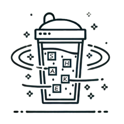

# ShakeStr


[](https://goreportcard.com/report/github.com/Qovop-Dev/ShakeStr)




The ShakeStr module is designed to manipulate strings in a flexible and dynamic way. It allows you to play with individual words or entire texts by applying various shuffling and transformation algorithms. This module is particularly useful in contexts where you want to generate random or specific variations of words or phrases, such as in games, puzzles, or linguistic tests..

We are proud to release or first version of ShakeStr (v1.1.1) in August 2024.


## Table of Contents
- [ShakeStr](#shakestr)
  - [Table of Contents](#table-of-contents)
  - [Getting Started](#getting-started)
  - [Key Features](#key-features)
    - [Word Manipulation](#word-manipulation)
    - [Text Manipulation](#text-manipulation)
    - [Punctuation Handling](#punctuation-handling)
  - [Usage](#usage)
    - [Parameters](#parameters)
      - [For Word Manipulation](#for-word-manipulation)
      - [For Text Manipulation](#for-text-manipulation)
    - [Example Usage](#example-usage)
  - [Conclusion](#conclusion)
  - [Contact](#contact)

## Getting Started
You can simply add this module to your project by running this command :
```sh
$ go get github.com/Qovop-Dev/ShakeStr
```

## Key Features

### Word Manipulation
 - Shuffle the middle of the word: Shuffles only the internal letters of a word, leaving the first and last letters unchanged.
 - Full word shuffle: Shuffles all the letters of a word, including the first and last letters.
 - Reverse the word: Reverses the order of the letters in a word.

### Text Manipulation
 - Reverse the text: Reverses the order of all characters in the text.
 - Reverse the words in the text: Reverses the order of words while keeping each word intact.
 - Shuffle the order of words: Changes the order of words without altering the internal letters.
 - Shuffle the middle of each word while keeping the order: Only the internal letters of each word are shuffled, but the order of words remains the same.
 - Shuffle the middle of each word and shuffle the order: The internal letters of each word are shuffled, and the order of words is also shuffled.
 - Fully shuffle each word while keeping the order: All letters in each word are shuffled, but the order of words remains the same.
 - Fully shuffle each word and shuffle the order: Both the letters within each word and the order of words are shuffled.

### Punctuation Handling
 - The module intelligently handles punctuation, ensuring that punctuation marks remain in their correct positions and are not included in the shuffling process. This makes the transformations more natural and readable.
 - Additionally, special attention has been given to parentheses, brackets, and similar symbols during the reversal process, ensuring they maintain their logical structure and placement.

## Usage
The module is centered around the Shake function, which takes a string (s) for the word or text to transform and a string (p) that specifies the type of transformation to apply. The p parameter is flexible, allowing you to choose different types of transformations for words or texts.

### Parameters

#### For Word Manipulation

| Feature                           | Parameter   | Example Input                 | Example Output                   |
| --------------------------------- | ----------- | ----------------------------- | -------------------------------- |
| Shuffle the middle of the word    | "wm"        | Welcome                       | Wlomcee                          |
| Full word shuffle                 | "wf"        | Welcome                       | eoclWem                          |
| Reverse the word                  | "wr"        | Welcome                       | emocleW                          |

#### For Text Manipulation

| Feature                                                 | Parameter   | Example Input                 | Example Output                   |
| ------------------------------------------------------- | ----------- |-------------------------------|----------------------------------|
| Reverse the text                                        | "tr"        | Hello, it’s nice to meet you! | !uoy teem ot ecin s‘ti ,olleH    |
| Reverse the words in the text                           | "trp"       | Hello, it’s nice to meet you! | !you meet to nice it’s ,Hello    |
| Shuffle the order of words                              | "tp"        | Hello, it’s nice to meet you! | to meet Hello, it’s nice you!    |
| Shuffle the middle of each word while keeping the order | "tm"        | Hello, it’s nice to meet you! | Hlleo, i’ts ncie to meet you!    |
| Shuffle the middle of each word and shuffle the order   | "tmp"       | Hello, it’s nice to meet you! | to Hlleo, ncie you! meet i’ts    |
| Fully shuffle each word while keeping the order         | "tf"        | Hello, it’s nice to meet you! | leloH, tis’ inec ot emte oyu!    |
| Fully shuffle each word and shuffle the order           | "tfp"       | Hello, it’s nice to meet you! | ot etem ’sti cein ouy! Helol,    |


### Example Usage

```go
result, err := Shake("Hello, World!", "tr")
if err != nil {
    fmt.Println("Error:", err)
} else {
    fmt.Println(result)  // Outputs: "!dlroW ,olleH"
}

```
In this example, the parameter "tr" indicates that the entire text should be reversed while keeping the punctuation intact.

## Conclusion

This module is ideal for anyone looking to manipulate strings in a creative and flexible manner while maintaining readability through careful punctuation handling.

## Contact

If you have any questions or need further assistance, please contact us at "qovop.dev@gmail.com".